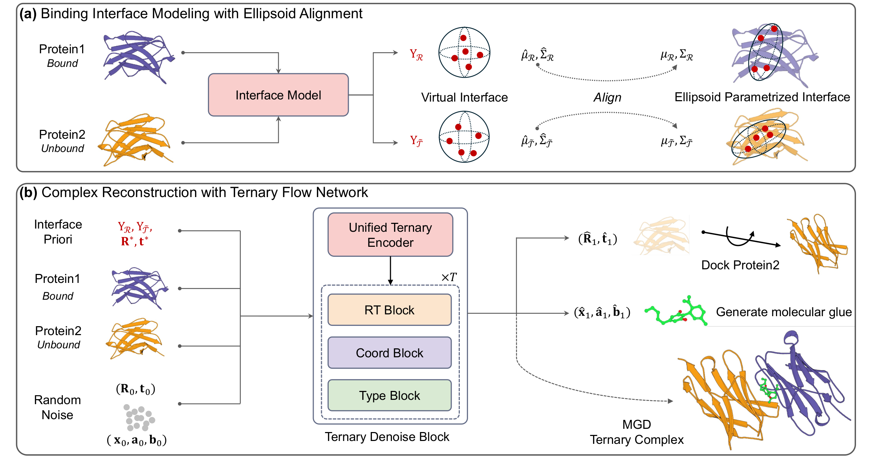

# TriGlue

<p align="center">
  
</p>

## Environment

TriGlue was tested with Python 3.10, PyTorch 2.6.0, and CUDA 12.4. A CUDA GPU is recommended; training and evaluation support multiple GPUs.

```text
torch==2.6.0
torch-geometric==2.6.1
torch_scatter==2.1.2+pt26cu124
torch_sparse==0.6.18+pt26cu124
torch_cluster==1.6.3+pt26cu124
lightning==2.6.1
pytorch-lightning==2.6.0
rdkit==2023.9.3
numpy==1.24.0
scipy==1.15.3
pandas==1.5.2
biopython==1.83
biopandas==0.5.1
datasets==4.8.4
einops==0.8.2
e3nn==0.6.0
easydict==1.9
lmdb==1.7.5
networkx==3.4.2
openbabel-wheel==3.1.1.11
PyYAML==6.0.3
tqdm==4.67.3
scikit-learn==1.7.2
vina==1.2.7
meeko==0.1.dev3
pillow==12.2.0
pymol-open-source==3.2.0a0
huggingface_hub==1.10.1
```

## Checkpoints and data

**Use `triglue_ckpt/triglue_latest.pt` for inference and paper reproduction.** This epoch-800 checkpoint is used for the reported molecular metrics, the final case studies, and the default evaluation/sampling scripts. `triglue_best.pt` is the epoch-245 validation-RMSD checkpoint and is provided as an optional alternative; it is not the default paper checkpoint.

| Role | Local path | Notes |
|---|---|---|
| **TriGlue (paper/default)** | `triglue_ckpt/triglue_latest.pt` | Epoch 800; recommended |
| TriGlue (validation-best) | `triglue_ckpt/triglue_best.pt` | Epoch 245; optional |
| Interface encoder | `checkpoints/interface-model/latest.pt` | Frozen during flow training |
| SeFMol refinement | `SeFMol/ckpt/checkpoint/sefmol.pt` | Optional ligand refinement and Vina evaluation |

The weights and processed datasets are hosted on [Google Drive](https://drive.google.com/drive/folders/1L0Yxdl5cAOQAxO1cbaHtflLueYH9pcRu) and are not committed to this repository.

| Drive file | Local path after download/extraction |
|---|---|
| `triglue_latest.pt` | `triglue_ckpt/triglue_latest.pt` |
| `triglue_best.pt` | `triglue_ckpt/triglue_best.pt` |
| `interface_latest.pt` | `checkpoints/interface-model/latest.pt` |
| `sefmol.pt` | `SeFMol/ckpt/checkpoint/sefmol.pt` |
| `TernaryDataset_test_bonds.tar.gz` | `data/Moloctite/TernaryDataset_test_bonds/` |
| `MGD_test.tar.gz` | `data/TernaryDB/MGD_test/` |
| `TernaryDataset_bonds_filtered.tar.gz` | `data/Moloctite/TernaryDataset_bonds_filtered/` |
| `interface_modeling_dataset_1208.tar.gz` | `data/Moloctite/interface_modeling_dataset_1208/` |

```bash
mkdir -p triglue_ckpt checkpoints/interface-model SeFMol/ckpt/checkpoint \
  data/Moloctite data/TernaryDB

mv triglue_latest.pt triglue_best.pt triglue_ckpt/
mv interface_latest.pt checkpoints/interface-model/latest.pt
mv sefmol.pt SeFMol/ckpt/checkpoint/sefmol.pt

tar -xzf TernaryDataset_test_bonds.tar.gz -C data/Moloctite
tar -xzf MGD_test.tar.gz -C data/TernaryDB
tar -xzf TernaryDataset_bonds_filtered.tar.gz -C data/Moloctite
tar -xzf interface_modeling_dataset_1208.tar.gz -C data/Moloctite
```

Release checkpoint verification:

```text
triglue_best.pt    sha256 20b8bafd923927b15f465171c3e6f86091fed27b530af29099b94dd3b08890ce
triglue_latest.pt  sha256 ae64fe7752084f7b972b96bc0c89512525c6c860f56a8c42ba66cce433bf5b29
```

The frozen interface encoder is configured by `model.interface_model.path` in `configs/flow_matching_config.yaml`.

## Data layout

```text
data/Moloctite/TernaryDataset_bonds_filtered       # flow training set
data/Moloctite/TernaryDataset_test_bonds           # held-out test set (92 complexes)
data/Moloctite/interface_modeling_dataset_1208     # interface-model training set
data/TernaryDB/MGD_test                            # structures used by DockQ and Vina
```

The flow-training split is created in code using `train_split: 0.99`, `val_split: 0.01`, and seed 42.

## 1. Train the interface model (optional)

Skip this step when using the released interface checkpoint.

```bash
NPROC=8 \
DATASET_DIR=./data/Moloctite/interface_modeling_dataset_1208 \
CHECKPOINT_DIR=./checkpoints/interface-model \
bash train_interface.sh
```

## 2. Train TriGlue

The released flow model uses the current settings in `configs/flow_matching_config.yaml`:

- 800 epochs, batch size 12 per GPU, and BF16 mixed precision;
- Adam with a linear learning-rate schedule from `5e-4` to `3e-4`;
- loss weights `trans=1`, `rot=1`, `seq=1`, `bond=1`, `coords=5`, and `pose_coord=1`;
- bond-aware ligand generation and a frozen pretrained interface encoder.

```bash
bash train_flow.sh --gpus 0,1,2,3,4,5,6,7 \
  --config configs/flow_matching_config.yaml \
  --checkpoint_dir checkpoints_run \
  --dataset ./data/Moloctite/TernaryDataset_bonds_filtered
```

Training writes `latest.pt` and the validation-selected `best.pt` to the chosen checkpoint directory. The released files are renamed to make their role explicit:

```bash
mkdir -p triglue_ckpt
cp checkpoints_run/latest.pt triglue_ckpt/triglue_latest.pt
cp checkpoints_run/best.pt triglue_ckpt/triglue_best.pt
```

## 3. Evaluate protein and complex geometry

```bash
bash run_evaluation.sh
```

Default evaluation settings:

- checkpoint: `triglue_ckpt/triglue_latest.pt`;
- dataset: `data/Moloctite/TernaryDataset_test_bonds`;
- structures: `data/TernaryDB/MGD_test`;
- 100 trajectories per complex, 100 sampling steps, seed 42;
- GPUs `0,1,2,3,4,5,6,7`.

Paths and resources can be overridden without editing the script:

```bash
CHECKPOINT_PATH=triglue_ckpt/triglue_latest.pt \
OUTPUT_DIR=evaluation_results \
GPU_IDS=0,1,2,3,4,5,6,7 \
bash run_evaluation.sh
```

The output directory contains `summary_metrics.json` and `detailed_results.json`.

## 4. Evaluate generated ligands

Ligand evaluation consumes the trajectories saved by the preceding step. SeFMol refinement is enabled by default.

```bash
DETAILED_JSON=evaluation_results/detailed_results.json \
OUTPUT_JSON=evaluation_results/ligand_eval_results.json \
SEFMOL_REFINE=1 \
SEFMOL_CKPT=SeFMol/ckpt/checkpoint/sefmol.pt \
bash run_eval_ligand.sh
```

AutoDock Vina evaluation additionally requires `vina`, `meeko`, Open Babel, AutoDockTools, and `pdb2pqr30` to be available in the active environment.

Optional per-complex export:

```bash
python export_per_complex_best_metrics.py \
  --detailed evaluation_results/detailed_results.json \
  --ligand evaluation_results/ligand_eval_results.json \
  --output evaluation_results/per_complex_best_metrics.json
```

## 5. End-to-end sampling

Sample all test complexes:

```bash
SAMPLE_ALL=1 DEVICE=cuda:0 NUM_TRAJ=100 TRAJ_BATCH_SIZE=8 bash sample.sh
```

Sample one complex:

```bash
SAMPLE_ALL=0 COMPLEX_NAME=5MN0_A_B_A8S DEVICE=cuda:0 bash sample.sh
```

Lower `TRAJ_BATCH_SIZE` if sampling runs out of GPU memory. Checkpoint, dataset, output, and SeFMol paths can be overridden with `CHECKPOINT_PATH`, `DATASET_PATH`, `OUTPUT_DIR`, and `SEFMOL_CKPT`.

## Reproduce the reported results

1. Download `triglue_latest.pt`, the interface and SeFMol checkpoints, and the processed test data.
2. Place them at the paths listed above.
3. Run `bash run_evaluation.sh` for RMSD and DockQ.
4. Run `bash run_eval_ligand.sh` for ligand and Vina metrics.

Use **`triglue_latest.pt`** for paper reproduction. Use `triglue_best.pt` only when explicitly evaluating the validation-selected checkpoint.

## Project entry points

| Script | Purpose |
|---|---|
| `train_interface.sh` / `interface_training.py` | Interface-model training |
| `train_flow.sh` / `flow_training.py` | TriGlue training |
| `run_evaluation.sh` / `evaluation.py` | RMSD, DockQ, and complex evaluation |
| `run_eval_ligand.sh` / `eval_ligand.py` | Ligand refinement, molecular properties, and Vina |
| `sample.sh` / `sample.py` | End-to-end sampling and optional rendering |
